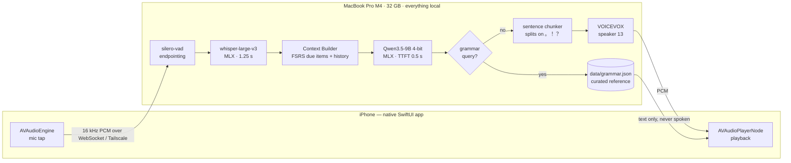
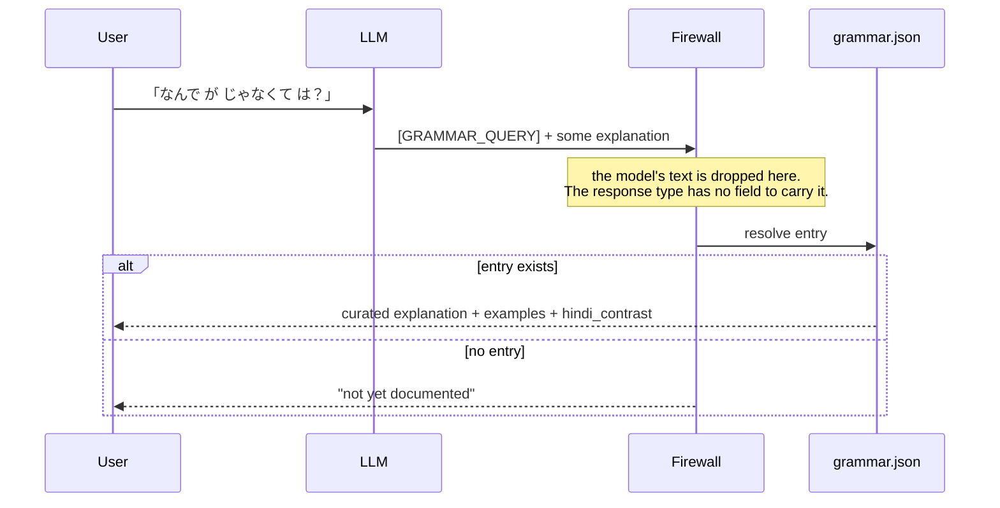
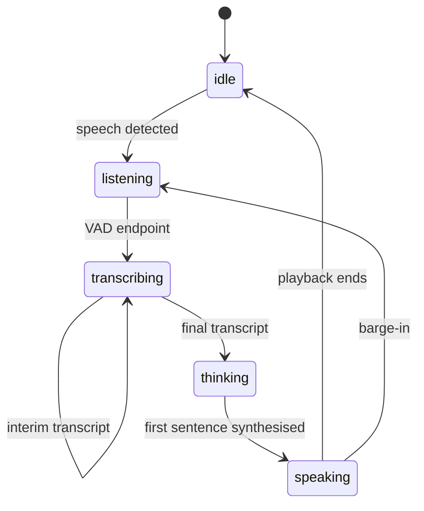

# LOcha 🍵

*Language Ocha — like tea or coffee starts the day, start the day learning a language.*

A self-hosted Japanese conversation tutor that runs entirely on one MacBook Pro, talks back in real time, and costs **$0/month**. No cloud API is called from any code path — that is a hard architectural constraint, tested by a suite that fails if an outbound request appears.

You speak Japanese into an iPhone. The Mac listens, thinks, and answers out loud. What it chooses to say is steered by a spaced-repetition scheduler, so the conversation keeps dragging you back to the words you are about to forget.

---

## Why this exists rather than using Duolingo / Speak / Falou

Three things, in order of how much they matter:

1. **Grammar explanations are never generated.** When the model detects a grammar question it is not allowed to answer — it emits a sentinel and its own text is discarded. The explanation comes from a hand-authored reference file. An LLM that is confidently wrong about は vs が is worse than no tutor at all, and this is the one part of the system with a test that must never be weakened.
2. **The vocabulary is earned, not offered.** The tutor may only use words you have already practised, plus at most one new word per turn, glossed. The word list comes from FSRS scheduling, so the conversation is a drill disguised as a chat.
3. **Pitch accent is measured, not vibed.** Japanese meaning rides on a high/low pattern across morae — 箸 (chopsticks) and 橋 (bridge) differ only in pitch. The long-term goal is to score that deterministically and feed the score back into scheduling. This is deferred until after October 2026; see [PRD.md](PRD.md) §10 for the trade.

The learner's L1 is Hindi, which the design treats as information rather than trivia: Hindi and Japanese genuinely share SOV order, postpositions and pro-drop, but Hindi's ergative ने is *not* Japanese が, and Hindi's weight-based stress actively interferes with Japanese pitch. Reference entries carry an `interference_warning` flag for exactly these.

---

## The conversation loop



Everything inside the Mac box is a local process. The only network hop is the Tailscale link between phone and laptop.

### The firewall, which is the load-bearing part



The model's explanation is not filtered, ranked, or fact-checked — it is structurally unable to reach the user, because the object returned on this path has nowhere to put it. On a reference miss the honest answer is given instead of a generated one.

---

### What the user is told while all that happens

A real turn takes ~2.5 s. That is fine, and a silent 2.5 s is not — a silent gap reads as a crash, the same gap with a live transcript reads as listening. So every stage boundary maps to a state the client can actually render, and there is deliberately no `processing` catch-all: a state nobody can see does not count as feedback.



`TurnStateProbe` taps the pipeline, records the timeline, and pushes each change to the client ahead of the frame that caused it. A test asserts the probe never buffers or reorders a frame — an instrument that perturbs what it measures is worse than none — and another asserts the criterion is violable, so the check cannot silently stop detecting anything.

---

## Status — July 2026

| Phase | What it delivers | State |
| --- | --- | --- |
| **0** | Measurements: hardware bandwidth, ASR bake-off, LLM latency, co-resident contention | ✅ `benchmarks/` |
| **1** | Context Builder, FSRS rating derivation, grammar firewall, `POST /turn` | ✅ 159 tests |
| **2** | WebSocket transport, VAD, ASR, TTS, native iOS client | 🔨 in progress |
| **3** | Alignment-free GOP + comparative pitch scoring | ⏸ deliberately post-October |

**Phase 0 was not ceremony.** It falsified most of the original architecture:

- The ASR choice **reversed**. A Japanese-specialised distillation was the obvious pick and lost 6.7× on character error rate — it is trained on native speech, and the input is an accented beginner code-switching mid-sentence. The generalist won on the exact axis the specialist was chosen for.
- The LLM choice **reversed twice**. Once on grammar correctness (the recommended model accepted 今日は何を食べるですか, a chapter-3 error), then again on memory: the Mixture-of-Experts model that bandwidth arithmetic demanded caused ~340,000 swapouts in an 8-turn burst once whisper and VOICEVOX were also resident. The dense alternative caused zero.
- The **latency goal was retired**. 1.2 s p50 was unreachable — the two measured stages alone spend 2.15 s. It was replaced by two criteria that describe what actually makes a conversation feel broken: *no dead air beyond 500 ms without feedback*, and a measured regression bound.

The lesson from the second point is now a standing rule: **measure components co-resident, never alone.** A component benchmarked by itself answers a question the product never asks.

---

## Running it

```bash
uv sync
make dev          # POST /turn on :8000, WebSocket voice loop on /ws
make check        # ruff + mypy --strict + pytest
make test-slow    # loads the real 5 GB model; needs VOICEVOX on :50021
```

VOICEVOX Engine runs separately (CPU, port 50021) and is the only non-Python service. **Speaker 13 (青山龍星)** is pinned as a dependency, not a preference: TTS output is the reference recording for pitch scoring, and an octave gap between reference and learner degrades alignment even after normalisation.

The iOS client is sideloaded with a free Apple Developer account, which means the provisioning profile **expires every 7 days** and the app is re-deployed from Xcode weekly. That is an accepted operating cost of the $0/month constraint, not an oversight.

---

## Layout

```text
PRD.md            requirements, gates, the deliberate trades
ARCHITECTURE.md   component rationale — including what it got wrong and why
TASKS.md          the work queue
benchmarks/       Phase 0 output: reports, not throwaway scripts
data/grammar.json the curated reference the firewall serves from
src/ocha/
  api/            FastAPI routes, /turn and /ws
  tutor/          context builder, firewall, LLM service
  speech/         wire format, pipeline, instrumentation
  scheduling/     py-fsrs wrapper, rating derivation
  db/             schema, migrations
tests/            159 tests; the firewall ones are not negotiable
```

Design documents are kept honest rather than tidy: where a measurement contradicted a decision, the original reasoning is struck through and left in place with the number that killed it. `ARCHITECTURE.md` §3.0 is titled *"What this section got wrong."*

---

## Stack

Python 3.12 · `uv` · FastAPI · SQLite (WAL) · MLX · Pipecat 1.6 · `py-fsrs` · `fugashi`/`unidic-lite` · SwiftUI client · `ruff` + `mypy --strict` + `pytest`
